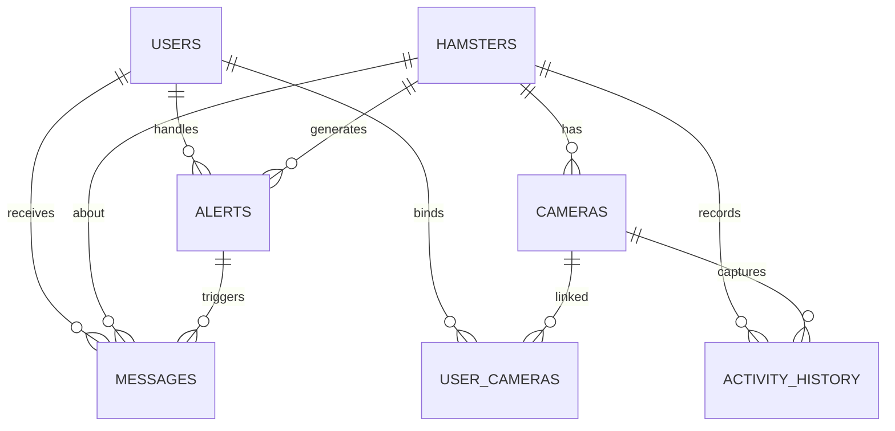

# 仓鼠健康预警 AIoT 系统 - 数据库表结构

> 时间字段统一使用 UTC 存储，接口层统一按 ISO8601 输出（例如 `2026-04-22T10:00:00Z`）。
> 删除策略统一为软删除，不做物理删除。
> **说明**：本文件仅描述**数据库列名**（snake_case）。对外 HTTP JSON 字段命名以 `api-specification.md` 为准（camelCase，与 Spring 默认序列化一致）。

## 一、用户表 `users`

当前部署为单管理员使用场景，用于登录和站内信接收；数据模型预留多用户扩展能力。

| 字段 | 类型 | 说明 | 约束 |
|------|------|------|------|
| id | INT | 主键，自增 | PK |
| username | VARCHAR(50) | 用户名 | NOT NULL, UNIQUE |
| password_hash | VARCHAR(255) | 密码哈希（BCrypt） | NOT NULL |
| email | VARCHAR(100) | 邮箱 | |
| created_at | DATETIME | 创建时间（UTC） | DEFAULT CURRENT_TIMESTAMP |
| updated_at | DATETIME | 更新时间（UTC） | |

## 二、仓鼠信息表 `hamsters`

存储仓鼠基本信息。

| 字段 | 类型 | 说明 | 约束 |
|------|------|------|------|
| id | INT | 主键，自增 | PK |
| name | VARCHAR(50) | 名字 | NOT NULL |
| breed | VARCHAR(50) | 品种 | |
| birth_date | DATE | 出生日期 | |
| gender | TINYINT | 性别：0未知/1公/2母 | DEFAULT 0 |
| weight | DECIMAL(5,2) | 当前体重(g) | |
| avatar | VARCHAR(255) | 头像URL | |
| remark | VARCHAR(500) | 备注 | |
| health_status | TINYINT | 健康状态：0正常/1异常/2治疗中 | DEFAULT 0 |
| is_deleted | TINYINT | 软删除标记：0否/1是 | DEFAULT 0 |
| created_at | DATETIME | 创建时间（UTC） | DEFAULT CURRENT_TIMESTAMP |
| updated_at | DATETIME | 更新时间（UTC） | |
| deleted_at | DATETIME | 删除时间（UTC） | |

## 三、摄像头表 `cameras`

管理萤石摄像头设备。按摄像头维度独立维护令牌。

| 字段 | 类型 | 说明 | 约束 |
|------|------|------|------|
| id | INT | 主键，自增 | PK |
| hamster_id | INT | 关联仓鼠ID | FK → hamsters.id |
| name | VARCHAR(50) | 摄像头名称 | NOT NULL |
| device_key | VARCHAR(100) | 萤石设备序列号 | NOT NULL |
| channel_no | INT | 通道号 | DEFAULT 1 |
| access_token | TEXT | 摄像头访问令牌（加密存储） | |
| token_expires | DATETIME | 令牌过期时间（UTC） | |
| last_online_time | DATETIME | 最后在线时间（UTC） | |
| online_status | TINYINT | 在线状态：0离线/1在线 | DEFAULT 0 |
| recording_enabled | TINYINT | 录像开关：0关闭/1开启 | DEFAULT 0 |
| is_deleted | TINYINT | 软删除标记：0否/1是 | DEFAULT 0 |
| created_at | DATETIME | 创建时间（UTC） | DEFAULT CURRENT_TIMESTAMP |
| updated_at | DATETIME | 更新时间（UTC） | |
| deleted_at | DATETIME | 删除时间（UTC） | |

## 四、用户摄像头映射表 `user_cameras`

通过映射表维护用户与摄像头关系，替代 `users` 表 JSON 数组方案。

| 字段 | 类型 | 说明 | 约束 |
|------|------|------|------|
| id | INT | 主键，自增 | PK |
| user_id | INT | 用户ID | FK → users.id |
| camera_id | INT | 摄像头ID | FK → cameras.id |
| is_deleted | TINYINT | 软删除标记：0否/1是 | DEFAULT 0 |
| created_at | DATETIME | 创建时间（UTC） | DEFAULT CURRENT_TIMESTAMP |
| updated_at | DATETIME | 更新时间（UTC） | |
| deleted_at | DATETIME | 删除时间（UTC） | |

> 约束建议：唯一索引 `uk_user_camera(user_id, camera_id, is_deleted)`，避免同一用户重复绑定同一摄像头。

## 五、预警记录表 `alerts`

存储健康预警记录。

| 字段 | 类型 | 说明 | 约束 |
|------|------|------|------|
| id | INT | 主键，自增 | PK |
| hamster_id | INT | 关联仓鼠ID | FK → hamsters.id |
| activity_status | VARCHAR(20) | 活动状态：normal/low/high | NOT NULL |
| activity_score | INT | 活动评分(0-100) | NOT NULL |
| threshold | INT | 触发阈值 | NOT NULL |
| image_url | VARCHAR(255) | 截图URL | |
| status | TINYINT | 处理状态：0未处理/1已读/2已处理 | DEFAULT 0 |
| handler_id | INT | 处理人ID | FK → users.id |
| handle_remark | VARCHAR(500) | 处理备注 | |
| is_deleted | TINYINT | 软删除标记：0否/1是 | DEFAULT 0 |
| created_at | DATETIME | 预警时间（UTC） | DEFAULT CURRENT_TIMESTAMP |
| handled_at | DATETIME | 处理时间（UTC） | |
| deleted_at | DATETIME | 删除时间（UTC） | |

## 六、站内信表 `messages`

存储站内信消息，用于预警通知。

| 字段 | 类型 | 说明 | 约束 |
|------|------|------|------|
| id | INT | 主键，自增 | PK |
| hamster_id | INT | 关联仓鼠ID | FK → hamsters.id |
| alert_id | INT | 关联预警ID | FK → alerts.id |
| user_id | INT | 接收用户ID | FK → users.id |
| title | VARCHAR(100) | 消息标题 | NOT NULL |
| content | TEXT | 消息内容 | NOT NULL |
| is_read | TINYINT | 已读状态：0未读/1已读 | DEFAULT 0 |
| is_deleted | TINYINT | 软删除标记：0否/1是 | DEFAULT 0 |
| created_at | DATETIME | 创建时间（UTC） | DEFAULT CURRENT_TIMESTAMP |
| updated_at | DATETIME | 更新时间（UTC） | |
| deleted_at | DATETIME | 删除时间（UTC） | |

## 七、活动量历史表 `activity_history`

存储历史活动量数据，用于趋势分析。

| 字段 | 类型 | 说明 | 约束 |
|------|------|------|------|
| id | INT | 主键，自增 | PK |
| hamster_id | INT | 关联仓鼠ID | FK → hamsters.id |
| camera_id | INT | 摄像头ID | FK → cameras.id |
| activity_score | INT | 活动评分(0-100) | NOT NULL |
| status | VARCHAR(20) | 活动状态：normal/low/high | NOT NULL |
| analysis_result | TEXT | AI分析详情 | |
| image_url | VARCHAR(255) | 截图URL | |
| created_at | DATETIME | 采样时间（UTC） | DEFAULT CURRENT_TIMESTAMP |

## 八、系统配置表 `settings`

存储系统配置参数。

| 字段 | 类型 | 说明 | 约束 |
|------|------|------|------|
| id | INT | 主键，自增 | PK |
| key_name | VARCHAR(50) | 配置键 | NOT NULL, UNIQUE |
| key_value | TEXT | 配置值 | |
| description | VARCHAR(100) | 说明 | |
| created_at | DATETIME | 创建时间（UTC） | DEFAULT CURRENT_TIMESTAMP |
| updated_at | DATETIME | 更新时间（UTC） | |

### 基础配置项

| key_name | key_value | description |
|----------|----------|-------------|
| activity_interval | 300 | 采样间隔（秒） |
| low_activity_threshold | 30 | 低活动阈值 |
| high_activity_threshold | 80 | 高活动阈值 |
| deepseek_api_key | *** | API密钥（加密存储） |

## 九、枚举值字典

### 9.1 活动状态（统一口径）

| 枚举值 | 含义 |
|--------|------|
| normal | 活动正常 |
| low | 活动偏低 |
| high | 活动偏高 |

### 9.2 预警处理状态 `alerts.status`

| 枚举值 | 含义 |
|--------|------|
| 0 | 未处理 |
| 1 | 已读 |
| 2 | 已处理 |

### 9.3 软删除标记 `is_deleted`

| 枚举值 | 含义 |
|--------|------|
| 0 | 未删除 |
| 1 | 已删除 |

## 十、表关系 ER 图



## 十一、业务流程

```
视频采集 → 截图 → DeepSeek API 分析 → 活动量评分 → 阈值比对
                                                     ↓
站内信通知 ← 预警记录创建 ←─────── 异常判定（low/high） ←───────┘
     ↓
用户处理预警 → 预警状态更新 → 留痕处理
```

## 十二、软删除与审计规则

1. 所有删除接口只更新 `is_deleted=1` 和 `deleted_at`，不做物理删除。
2. 查询列表与详情默认过滤 `is_deleted=1` 的记录。
3. 外键关联数据被软删除后，不立即级联删除，仅在业务层隐藏。
4. 所有写操作建议写入审计日志（操作人、目标ID、前后值、请求ID、时间）。
5. `user_cameras` 是用户与摄像头绑定关系唯一来源，不再依赖 `users` 表 JSON 字段。

## 十三、索引建议

| 表 | 索引字段 | 说明 |
|----|---------|------|
| hamsters | name, is_deleted | 按名字查询且过滤软删除 |
| cameras | hamster_id, is_deleted | 按仓鼠查摄像头 |
| user_cameras | user_id, camera_id, is_deleted | 用户摄像头绑定关系查询与去重 |
| alerts | hamster_id, status, is_deleted, created_at | 预警多条件查询 |
| alerts | created_at | 时间范围查询 |
| messages | user_id, is_read, is_deleted, created_at | 站内信查询 |
| activity_history | hamster_id, created_at | 历史趋势查询 |